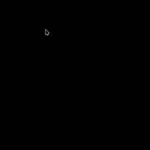

# kwin-effects-ba-click-fx

[](LICENSE)

English documentation: [README.en.md](README.en.md)

**从 Blue Archive Unity UI/FX_Touch 逐参数移植的 KDE Plasma KWin 点击特效与光标拖尾插件。**

`kwin-effects-ba-click-fx` 将 `FX_Touch` 中 ParticleSystem、TrailRenderer 与后处理参数逐项还原到 KWin：点击时播放中心圆盘、溶解圆环和 Ring3 粒子，按住左键拖动时生成 Ribbon 拖尾与 Ring4 距离发射粒子。渲染由原生 C++ / OpenGL 完成，使用线性 RGBA16F Scene 和 Unity PPv2 MXFinalBloom，不依赖脚本运行时。



## 特性

- 从 Unity 参数逐项移植，不是相似风格的重新设计
- 还原 Ring、MeshTri、Ring3、Ring4 与 TrailRenderer 的颜色、大小、旋转、寿命、UV 动画和 HDR 强度
- 使用 Cylinder002 原始网格与逐角 UV，粒子贴图由 Shader 直接采样
- 线性 RGBA16F Scene、HDR 粒子混合与 Unity PPv2 MXFinalBloom
- 稀疏 damage Region，仅导入、计算和合成本帧可能变化的区域
- 支持多显示器、HiDPI 和不同输出缩放比例
- 使用 KWin 指针事件保留高回报率鼠标的真实拖动轨迹
- 提供 KCM 配置页、重绘区域标记和 CPU/GPU 分段性能日志

## 运行要求

- KDE Plasma 6 / KWin 6.7 或更高版本
- OpenGL 合成器；项目没有 CPU 渲染回退
- CMake 3.20+
- ECM 6.26+
- Qt 6.10+
- KF6 6.26+
- 与当前运行版本匹配的 KWin 开发包

KWin 原生特效插件与 `EffectPluginFactory` ABI 绑定。升级 KWin 后必须用新版本开发包重新编译，否则 KWin 会忽略旧二进制。

## 安装

需要 C++ 编译器、CMake、ECM、Qt 6、KF6、KWin 和 OpenGL 开发文件。

Arch Linux：

```bash
sudo pacman -S --needed base-devel cmake extra-cmake-modules kwin
```

Fedora：

```bash
sudo dnf install -y cmake extra-cmake-modules kwin-devel
```

在项目目录运行：

```bash
./install-local.sh --system
```

请以当前用户运行脚本；安装到 `/usr` 时，脚本会自行请求管理员权限。安装后在「系统设置 → 外观与样式 → 桌面特效」中搜索 **BA Click FX** 并启用。首次安装或升级 KWin 后若未出现，注销并重新登录 Plasma。

常用选项：

```bash
JOBS=4 ./install-local.sh --system
./install-local.sh --no-reload
./install-local.sh --help
```

KWin 原生插件与当前 KWin 版本绑定；升级 KWin 后需要重新编译本插件。

右侧配置按钮提供：

- 时间缩放
- 整体尺寸
- 拖尾开关
- 沿途小三角开关
- 调试日志
- 重绘区域边框

颜色、粒子数量、拖尾宽度、发射间距和 Bloom 参数保持 Unity 原始值，不作为用户调节项。

卸载：

```bash
./uninstall-local.sh --system
```

用户级安装使用 `./uninstall-local.sh --user`。默认保留配置；追加 `--purge-config` 可同时删除配置和启用状态。

## 测试与兼容性

自动测试、嵌套 KWin 会话、双屏/HiDPI/HDR 验证和回滚说明见
[TESTING.md](TESTING.md)。

## 日志与诊断

日常使用优先通过设置页的“日志级别”“复制诊断信息”“生成诊断报告”和“打开诊断目录”操作。
设置页不可用时，可使用命令行备用入口：

```bash
kwriteconfig6 --file kwinrc --group Effect-ba-click-fx --key LogLevel 3
qdbus-qt6 org.kde.KWin /Effects reconfigureEffect kwin4_effect_ba_click_fx
```

日志级别为 `0=关闭`、`1=错误`、`2=实例`、`3=帧统计`、`4=详细调试`。查看日志：

```bash
journalctl --user --since=-2min -o cat QT_CATEGORY=kwin_effect_ba_click_fx
journalctl --user -f -n 0 -o cat QT_CATEGORY=kwin_effect_ba_click_fx
```

查询运行状态或生成结构化诊断：

```bash
qdbus-qt6 org.kde.KWin /Effects debug kwin4_effect_ba_click_fx status
qdbus-qt6 org.kde.KWin /Effects debug kwin4_effect_ba_click_fx diagnostics
```

报告保存在 `~/.cache/ba-click-fx/diagnostics/`。详细字段说明见 [TESTING.md](TESTING.md)。

显示重绘区域：

```bash
kwriteconfig6 --file kwinrc --group Effect-ba-click-fx --key DebugDamage true
qdbus-qt6 org.kde.KWin /Effects reconfigureEffect kwin4_effect_ba_click_fx
```

青色表示插件申请的逻辑重绘区域，洋红色表示 KWin 实际交给 effect 的输出渲染区域。性能测试时应关闭 `DebugDamage`。

## 热重载限制

`reconfigureEffect` 只重新读取配置。`unloadEffect` / `loadEffect` 可以重建 Effect 对象，但 Qt 会缓存已映射的 native plugin factory，因此覆盖一个正在使用的 `.so` 不会替换当前进程中的机器码。

- 配置修改可以立即生效
- 首次发现的新插件通常可以直接加载
- 已加载插件的 C++ 修改需要新的 KWin 进程
- 日常开发使用 `test-nested.sh`，正式安装后重新登录会话

## 渲染架构

每帧渲染顺序与 Unity UI Render Pass 对齐：

1. 将本帧变化区域的桌面像素导入线性 RGBA16F Scene。
2. 按 Unity Render Queue 顺序绘制 Trail、Ring/Ring3、Ring4 与 MeshTri。
3. 对真实亮源区域执行 PPv2 MXFinalBloom 金字塔。
4. 将 Scene 与 Bloom 合成并编码回 KWin 输出传递函数。

FBO 与 Bloom 金字塔按输出复用；damage Region 只减少无变化 texel 的导入、传播和合成，不改变 Shader、采样核、几何、粒子参数或最终视觉结果。

## 许可

项目代码采用 [GNU GPL v3.0 或更高版本](LICENSE)。Blue Archive 相关名称、商标及游戏来源的视觉资源归各自权利人所有，不包含在项目代码的 GPL 授权范围内。本项目是非官方的技术研究与桌面视觉效果实现，与 NEXON、NEXON Games、Yostar 等权利方无隶属或授权关系。

后续计划记录在 [TODO.md](TODO.md)。

参数分析与跨平台实现可参考 [ba-click-fx](https://github.com/CialloKing/ba-click-fx)。
